<style>
  @import './style.css';
</style>

# Scalaの関数型ライブラリを活用した型安全な<br/>業務アプリケーション開発

<div class="pt-12">
  <span class="text-white">
    関数型まつり 2025
  </span>
</div>

<div class="pt-4">
  <span class="text-white/80 text-sm">
    2025年6月15日
  </span>
</div>

<style>
  .slidev-layout {
    background: #1e293b;
  }
  .slidev-page-1 h1 {
    color: white !important;
    font-size: 1.875rem !important;
    line-height: 1.4 !important;
    font-weight: 700 !important;
    max-width: 90%;
    margin: 0 auto;
  }
  h1 {
    color: white;
    font-size: 1.875rem;
    line-height: 1.4;
    font-weight: 700;
  }
</style>

---
layout: intro
class: text-center
---

# 自己紹介

<div class="my-10 grid grid-cols-1 gap-4">
  <div class="flex items-center justify-center gap-4">
    
    <div class="text-left">
      <div class="text-xl font-bold">Tomoki Mizogami</div>
      <div class="text-sm opacity-70">株式会社ネクストビート</div>
      <div class="text-sm opacity-70">Webエンジニア（Scala歴6年）、🔰PdM</div>
    </div>
  </div>
</div>

<div class="my-8">
  <ul class="list-disc text-left max-w-2xl mx-auto space-y-2 pl-6">
    <li>新規事業開発・共通ライブラリ開発・認証基盤等を担当</li>
    <li>好きな言語 スペイン語🇪🇸</li>
    <li><a href="https://criceta.com/category-theory-with-scala/" target="_blank">Scalaで始める圏論入門</a></li>
  </ul>
  <div class="text-sm opacity-70 mt-6">
    <a href="https://x.com/taretmch" target="_blank" class="mr-4">@taretmch</a>
    <a href="https://github.com/taretmch" target="_blank">GitHub</a>
  </div>
</div>

---
layout: default
---

# 会社紹介


<div class="mb-6">
  <h2 class="text-2xl font-bold">株式会社ネクストビート <span class="text-base font-normal text-gray-600">(シルバースポンサー)</span></h2>
</div>

### ミッション

「人口減少社会において必要とされるインターネット事業を創造し、ニッポンを元気にする。」

### 事業領域

- **ライフイベント**: 保育園/法人向けSaaS、ベビーシッター事業、子育てメディア、求人情報・転職支援 etc.
- **地方創生**: 宿泊業界向け求人情報・転職支援 etc.
- **グローバル**: シンガポール事業、台湾事業 etc.

<br/>

### 技術スタック

- Scala, TypeScript (Svelte, NestJS, Angular, ...), ...

---
layout: image
image: ./images/nextbeat_hub.png
backgroundSize: cover
---

# Nextbeat Hub の紹介

<ul>
  <li>毎週木曜日20:00〜21:30</li>
  <li>ネクストビートの社員とカジュアルに話せる場</li>
  <li>関数型の話、大歓迎です</li>
</ul>


<style>
h1 {
  color: white;
}
li {
  font-size: 1.2rem;
  color: white;
}
</style>

---
layout: center
---

# 本日のテーマ

<div class="text-center">
  <p style="text-align: left;">Web アプリケーションに関数型の考え方を取り入れ、<span v-mark.underline.red>型安全に</span>開発する</p>
  <p style="text-align: left;">そのための基本要素をご紹介します</p>
</div>

---
layout: center
class: text-center
---

# 「型安全」

<div class="mt-16 grid grid-cols-2 gap-12">
  <div class="transform transition-all duration-300 hover:scale-105 text-center">
    <div class="text-6xl mb-4">🛡️</div>
    <h2 class="text-3xl font-bold text-blue-600">不正な値を作らせない</h2>
    <p class="text-xl text-gray-600 mt-2">コンパイル時に不正な状態を排除</p>
  </div>
  
  <div class="transform transition-all duration-300 hover:scale-105 text-center">
    <div class="text-6xl mb-4">🔒</div>
    <h2 class="text-3xl font-bold text-green-600">操作に副作用を含ませない</h2>
    <p class="text-xl text-gray-600 mt-2">純粋関数による予測可能な処理</p>
  </div>
</div>

---
layout: default
---

# 本日の流れ

<div class="grid grid-cols-2 grid-rows-2 gap-6 h-full">

<div class="px-4 py-3 rounded-lg border border-gray-200 h-40" style="background-color: #f1f5f9;">

## ① 🏗️ ドメインの表現
- ドメインモデルの表現
- ドメインのバリデーション  

</div>

<div class="px-4 py-3 rounded-lg border border-gray-200 h-40" style="background-color: #f1f5f9;">

## ② ⚙️  ユースケースの表現
- ユースケースの表現
- 副作用の抽象化

</div>

<div class="px-4 py-3 rounded-lg border border-gray-200 h-40" style="background-color: #f1f5f9;">

## ③ 🌐 技術実装
- 永続化
- 外部サービス連携

</div>

<div class="px-4 py-3 rounded-lg border border-gray-200 h-40" style="background-color: #f1f5f9;">

## ④ 🔗 統合
- インターフェースと実装の繋ぎ込み
- Web API エンドポイントの型安全な定義

</div>

</div>

<div class="text-center mt-6">

**🎯 目標: 型安全な職員管理 API の完成**

</div>

---
layout: center
class: text-center
---

# Part 1
## ドメインの記述
型安全なドメインの定義

<style>
  .slidev-layout {
    background: #1e293b;
  }
  h1, h2, p, ul, li {
    color: white;
  }
</style>

---
layout: default
---

# ドメインモデルの検討: パターン

モデルの構成要素は、主に以下の3つに分類できます。

| パターン | 説明 |
|----------|------|
| **プリミティブな型** | 基本的な値の表現 |
| **直積型** | 複数の値を組み合わせ |
| **直和型** | いくつかの選択肢から一つ |

---
layout: default
---

# ドメインモデルの検討: パターンの実装

Scalaでは、以下のような構造を用いてドメインモデルを表現できます。

| パターン | 目的 | Scala での主な実装手法 |
|----------|------|-------------------|
| **プリミティブな型** | 値オブジェクトとして基本的な値を表現 | Opaque Types |
| **直積型** | 複数の値を組み合わせて一つのデータを表現 | case class, Tuple |
| **直和型** | いくつかの選択肢から一つを表現 | Enum, Union Types, Either |

---
layout: default
---

# パターン: プリミティブな型

<h2 class="text-2xl font-bold mb-6">Opaque Types によってプリミティブな型を表現</h2>

<div class="grid grid-cols-2 gap-8">

<div>

```scala
opaque type GivenName = String
opaque type FamilyName = String

object GivenName:
  def apply(value: String): GivenName = value
object FamilyName:
  def apply(value: String): FamilyName = value

val givenName  = GivenName("太郎")
val familyName = FamilyName("山田")

// 型の混同を防ぐ - これはコンパイルエラー
val invalidAssign: GivenName = familyName // ❌
```

</div>

<div>

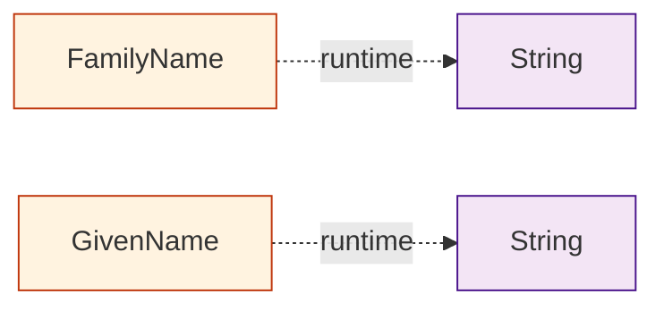

<div class="p-4 rounded-lg border border-gray-200 mt-4" style="background-color: #f1f5f9;">
  <h4 class="text-base font-bold mb-3">💡 特徴・メリット</h4>
  <div class="space-y-2">
    <ul>
      <li class="text-xs">実行時はプリミティブな型と解釈される。ランタイムコストゼロ</li>
      <li class="text-xs">定義したスコープ以外では異なる型として解釈される</li>
    </ul>
  </div>
</div>

</div>

</div>

---
layout: default
---

# パターン: 直積型

<h2 class="text-2xl font-bold mb-6">case class を用いて値の組み合わせを表現</h2>

<div class="grid grid-cols-2 gap-8">

<div>

```scala
case class Name(
  familyName: FamilyName,
  givenName:  Option[GivenName]
)

val name = Name(
  FamilyName("山田"), 
  Some(GivenName("太郎"))
)

println(name)
// Name(山田,Some(太郎))
```

</div>

<div>

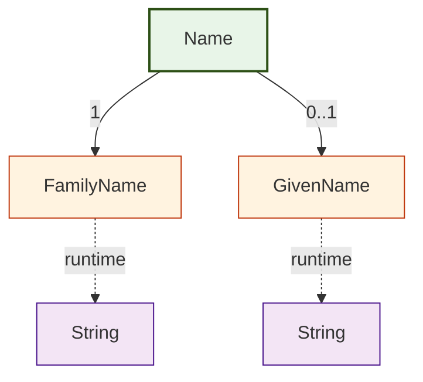

</div>

</div>

---
layout: default
---

# パターン: 直和型 (Enum)

<h2 class="text-2xl font-bold mb-6">Enum を用いて選択肢を表現</h2>

<div class="grid grid-cols-2 gap-8">

<div>

```scala
enum Role:
  case Manager, Member

// パラメータ付きでより詳細に
enum DetailedRole(val displayName: String):
  case Manager extends DetailedRole("管理者")
  case Member  extends DetailedRole("一般職員")

val role: Role = Role.Manager
val detailedRole = DetailedRole.Manager

println(detailedRole.displayName)
// "管理者"
```

</div>

<div>

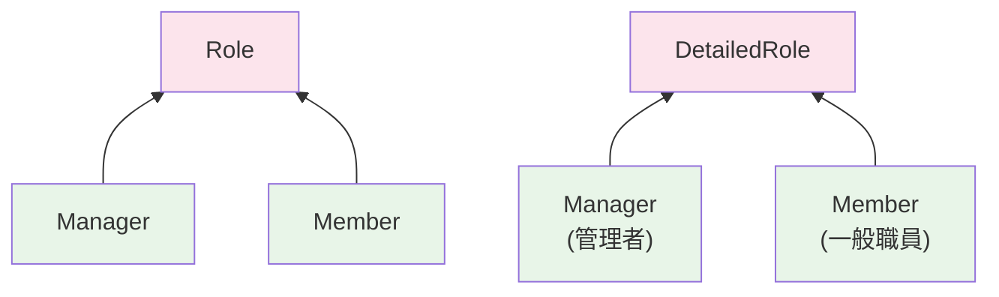

</div>

</div>

---
layout: default
---

# パターン: 直和型 (Union Types)

<h2 class="text-2xl font-bold mb-6">Union Types を用いて異なる型の選択肢を表現</h2>

<div class="grid grid-cols-2 gap-8">

<div>

```scala
// ログインIDの例
opaque type Username = String
opaque type EmailAddress = String
case class UsernameAndEmailAddress(
  username: Username, 
  email:    EmailAddress
)

type LoginId = Username
  | EmailAddress
  | UsernameAndEmailAddress

val loginWithUsername: LoginId = username
val loginWithEmail: LoginId = email
val loginWithBoth: LoginId = UsernameAndEmailAddress(username, email)
```

</div>

<div>

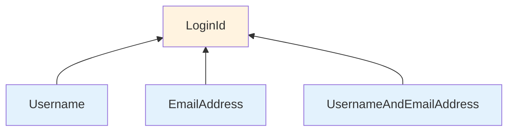

</div>

</div>

---
layout: default
---

# ドメインモデルの検討: 職員

以下のような職員データをモデル化することを考えます。

| 項目 | 説明 |
|------|------|
| **ID** | 職員は ID を持つ。ID の形式は UUIDv4 とする |
| **職員名** | 姓名を持つ。姓名のうち、名は任意 |
| **メールアドレス** | メールアドレスを持つ。未検証 or 検証済みの管理がされる |
| **ロール** | 管理者 or 一般職員 |
| **ログインID** | ユーザー名、またはメールアドレス。デフォルトはメールアドレス |

**🎯 これらの要件を型安全に表現していきましょう**

---
layout: default
---

# ドメインモデルの実装: 職員ID

<div class="mb-4">
  <span class="text-xs bg-gray-700 text-white px-2 py-1 rounded-sm font-mono">要件</span>
  <span class="text-sm ml-2 italic text-gray-600">職員は ID を持つ。ID の形式は UUIDv4 とする</span>
</div>

職員 ID を Opaque Types で定義します。UUID の生成は副作用を伴うため、生成はユースケース層で行い、ドメインモデルでは ID の型のみを定義します。

<div class="grid grid-cols-5 gap-8">

<div class="col-span-3">

```scala
// UUID型からIDへの変換を提供する型クラス
trait FromUUID[K]:
  def fromUUID(uuid: UUID): K

object FromUUID:
  def apply[K](using instance: FromUUID[K]): FromUUID[K] = instance

// Opaque Type による職員 ID の定義
opaque type Id = UUID
object Id:
  def fromUUID(uuid: UUID): Id = uuid

  extension (id: Id) 
    def value: UUID = id

  given FromUUID[Id] = new FromUUID[Id]:
    def fromUUID(uuid: UUID): Id = Id.fromUUID(uuid)
```

</div>

<div class="col-span-2">

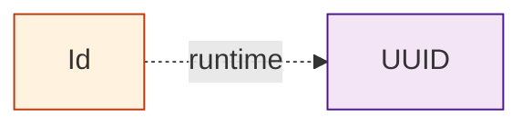

</div>

</div>

---
layout: default
---

# ドメインモデルの実装: 職員名

<div class="mb-4">
  <span class="text-xs bg-gray-700 text-white px-2 py-1 rounded-sm font-mono">要件</span>
  <span class="text-sm ml-2 italic text-gray-600">職員名を持つ。姓名のうち、名は任意</span>
</div>

姓名をそれぞれ値オブジェクトで表現し、直積型で結合して表現しています。

<div class="grid grid-cols-5 gap-8">

<div class="col-span-3">

```scala
// 各フィールドは値オブジェクトで表現
opaque type GivenName = String
opaque type FamilyName = String
object GivenName:
  def apply(value: String): GivenName = value
object FamilyName:
  def apply(value: String): FamilyName = value

// 姓名の組み合わせを直積型で表現。名は任意なので Option[_] 型で包む
case class Name(
  familyName: FamilyName,
  givenName:  Option[GivenName]
)

val name = Name(FamilyName("山田"), Some(GivenName("太郎")))

println(name)
// Name(山田,Some(太郎))
```

</div>

<div class="col-span-2">


</div>

</div>

---
layout: default
---

# ドメインモデルの実装: メールアドレス

<div class="mb-4">
  <span class="text-xs bg-gray-700 text-white px-2 py-1 rounded-sm font-mono">要件</span>
  <span class="text-sm ml-2 italic text-gray-600">メールアドレスを持つ。メールアドレスは未検証 or 検証済みの管理がされる</span>
</div>

メールアドレス文字列、検証状態を持つ直和型を定義し、メールアドレスの状態を型で表現しています。

<div class="grid grid-cols-4 gap-8">

<div class="col-span-3">

```scala
sealed abstract class EmailAddress(value: String, val isValidated: Boolean)
case class UnvalidatedEmailAddress(value: String) extends EmailAddress(value, false):
  def toValidated: ValidatedEmailAddress = ValidatedEmailAddress(value)
case class ValidatedEmailAddress(value: String)   extends EmailAddress(value, true)

val unvalidatedEmail = UnvalidatedEmailAddress("taro.yamada@example.com")
val validatedEmail   = unvalidatedEmail.toValidated

println(unvalidatedEmail)
// UnvalidatedEmailAddress(taro.yamada@example.com)
println(unvalidatedEmail.isValidated)
// false

println(validatedEmail)
// ValidatedEmailAddress(taro.yamada@example.com)
println(validatedEmail.isValidated)
// true
```

</div>

<div class="col-span-1">

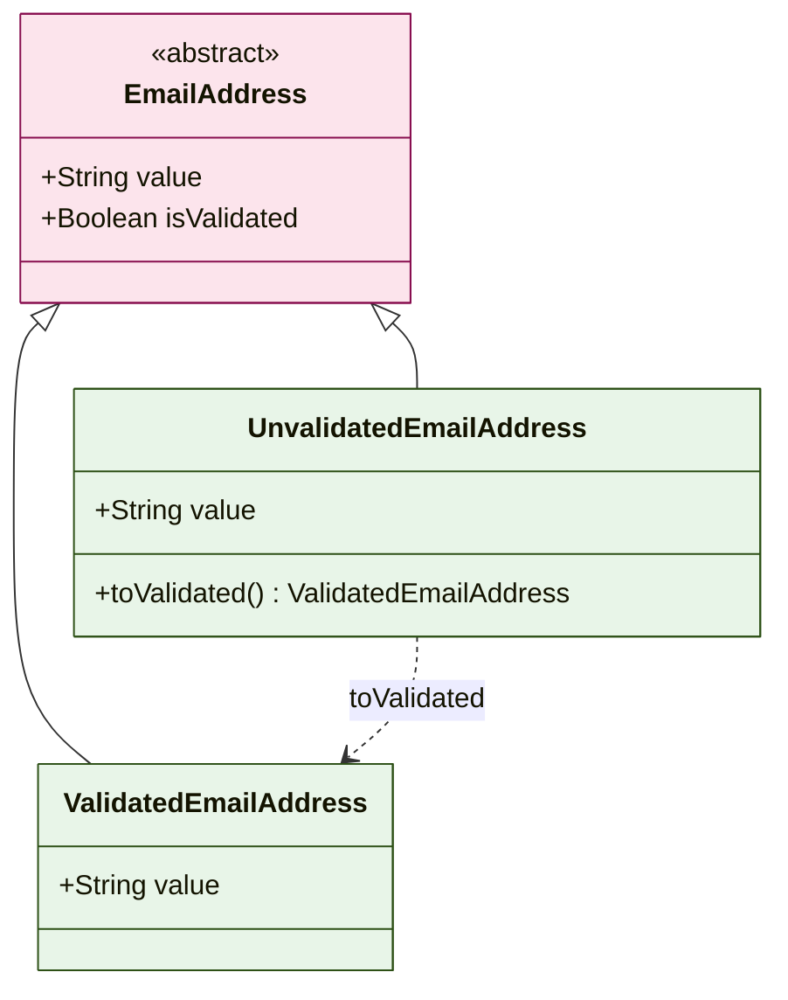

</div>

</div>

---
layout: default
---

# ドメインモデルの実装: ロール

<div class="mb-4">
  <span class="text-xs bg-gray-700 text-white px-2 py-1 rounded-sm font-mono">要件</span>
  <span class="text-sm ml-2 italic text-gray-600">ロールは管理者 or 一般職員</span>
</div>

ロールは階層構造を持った選択肢の構造なので、Enum として表現するのが適切でしょう。sealed abstract class + case object, Union Types でも表現できますが、今回は Enum で定義するのが最もシンプルです。

<div class="grid grid-cols-5 gap-8">

<div class="col-span-3">

```scala
// パラメータを持たせることができる
enum Role(val value: String, val displayName: String):
  case Manager extends Role("manager", "管理者")
  case Member  extends Role("member", "一般職員")

// Enum で定義すると、values メソッドなど便利なメソッドが生えてくる
Role.values.foreach: role =>
  println(s"${role} : ${role.value}, ${role.displayName}")
// Manager, manager, 管理者
// Member, member, 一般職員
```

</div>

<div class="col-span-2">

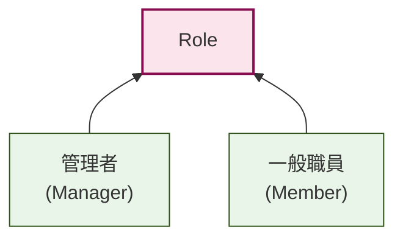

</div>

</div>

---
layout: default
---

# ドメインモデルの実装: ログインID

<div class="mb-4">
  <span class="text-xs bg-gray-700 text-white px-2 py-1 rounded-sm font-mono">要件</span>
  <span class="text-sm ml-2 italic text-gray-600">ログインIDはユーザー名、またはメールアドレス。デフォルトはメールアドレス</span>
</div>

ユーザー名は値オブジェクトとして定義し、ログインIDはユーザー名とメールアドレスの組み合わせで表現することができます。

<div class="grid grid-cols-5 gap-8">

<div class="col-span-3">

```scala
opaque type Username = String
object Username:
  def apply(value: String): Username = value

case class LoginId(username: Option[Username], email: EmailAddress)
```

</div>

<div class="col-span-2">

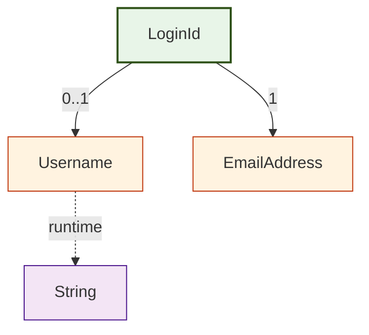

</div>

</div>

---
layout: default
---

# ドメインモデルの実装: ログインID (Union Types版)

Union Types を使って表現すると起きうる状態を明確に表現できます。

<div class="grid grid-cols-5 gap-8">

<div class="col-span-3">

```scala
case class UsernameAndEmailAddress(
  username: Username,
  email:    EmailAddress
)
// 「メールアドレスのみ、または、メールアドレス&ユーザー名どちらも利用可能」を表現
// Username 単体の状態があると、Union Types の方が表現しやすくなる
type LoginId = EmailAddress | UsernameAndEmailAddress

val email = UnvalidatedEmailAddress("taro.yamada@example.com")
val username = Username("tyamada")

val loginId1: LoginId = UsernameAndEmailAddress(username, email)
val loginId2: LoginId = email
println(loginId1)
// UsernameAndEmailAddress(tyamada,UnvalidatedEmailAddress(taro.yamada@example.com))
println(loginId2)
// UnvalidatedEmailAddress(taro.yamada@example.com)
```

</div>

<div class="col-span-2">

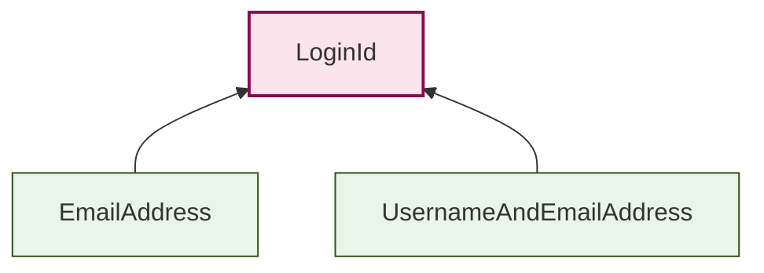

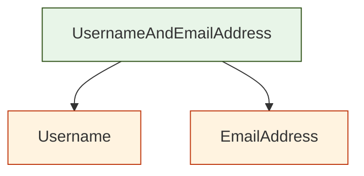

</div>

</div>

---
layout: default
---

# ドメインモデルの実装: 職員

これまでの値オブジェクトを組み合わせて、Staff モデルを作成しましょう。

<div class="grid grid-cols-2 gap-8">

<div>

```scala
case class Staff(
  id:       Staff.Id,
  name:     Staff.Name,
  username: Option[Staff.Username],
  email:    Staff.EmailAddress,
  role:     Staff.Role
):
  val loginId: Staff.LoginId = username match
    case Some(username) => Staff.UsernameAndEmailAddress(username, email)
    case None           => email

def create(id: Id, name: Name, email: EmailAddress, role: Role, username: Option[Username]): Staff =
  Staff(
    id       = id,
    name     = name,
    username = username,
    email    = email,
    role     = role
  )
```

</div>

<div>

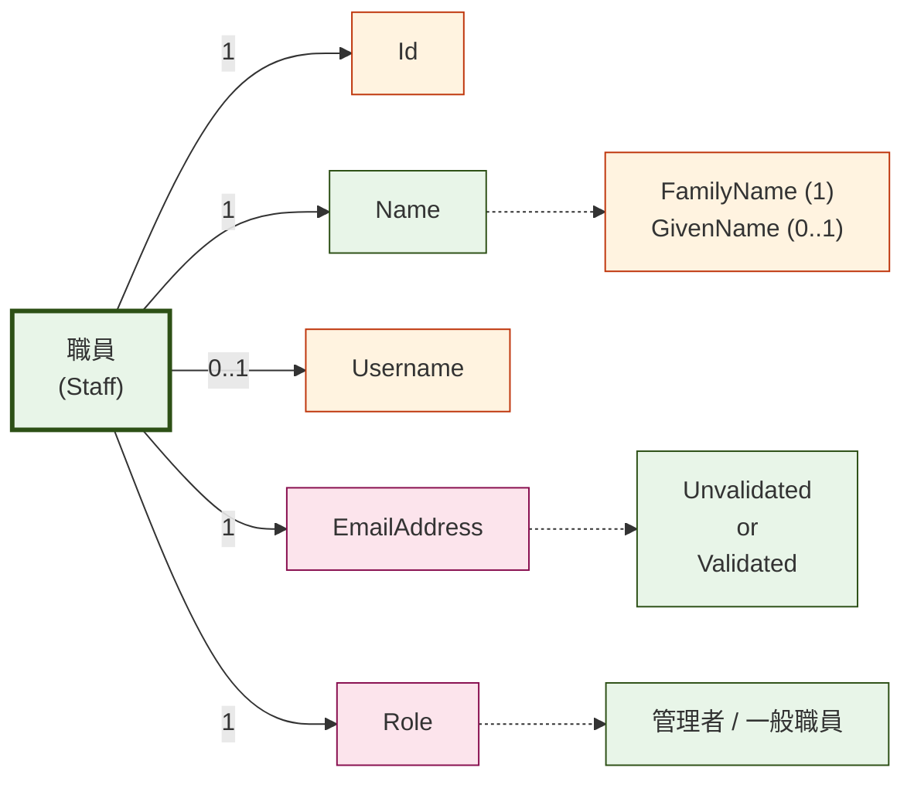

</div>

</div>

---
layout: default
---

# ドメインモデル: バリデーション

いまの実装では、名前やメールアドレスに不正な値を入れることができます。

```scala
// OK
val invalidEmail = EmailAddress("invalid-email")

// OK
val emptyName = GivenName("")
val invalidName = GivenName("とても長い名前とても長い名前とても長い名前とても長い名前とても長い名前とても長い名前とても長い名前とても長い名前とても長い名前とても長い名前とても長い名前とても長い名前とても長い名前とても長い名前とても長い名前とても長い名前")
```

値オブジェクトを生成した時点で、値オブジェクト自体の制約は満たすようにしたいです。

---
layout: default
---

# ドメインモデル: バリデーション

職員モデルの要件に、以下の制約を追加します。

| 項目 | 制約 |
|------|------|
| **職員名** | 姓名それぞれ1文字以上32文字以下 |
| **メールアドレス** | [WHATWG](https://html.spec.whatwg.org/multipage/input.html#valid-e-mail-address) で定義された正規表現 |
| **ユーザー名** | 4文字以上16文字以下 |

---
layout: default
---

# ドメインモデル: バリデーション実装

バリデーションの実装方法はいくつかありますが、ここでは以下の2つの方法を紹介します。

- スマートコンストラクタ
  - 値オブジェクトの生成時にバリデーションを行い、不正な値の生成を防ぐ
- Refinement Types
  - 値オブジェクトの制約を型で表現し、コンパイル時に不正な値を排除する

---
layout: default
---

# バリデーション実装: スマートコンストラクタ

<div class="smart-constructor">
<p class="description">スマートコンストラクタを用いて、値オブジェクトの生成時にバリデーションを行い、不正な値の生成を防ぎます。</p>

<div class="implementation-example">
<div class="code-part">
<h4>実装</h4>

```scala
object GivenName:
  def apply(value: String): Either[String, GivenName] =
    if value.isEmpty then 
      Left("GivenName must not be empty.")
    else if value.length > 32 then 
      Left("GivenName must be less than or equal to 32.")
    else 
      Right(value)
```
</div>

<div class="example-part">
<h4>使用例と結果</h4>

```scala
val valid    = GivenName("太郎")
val invalid1 = GivenName("")
val invalid2 = GivenName("あ" * 33)
```

<div class="validation-results">
<div class="result ok">✅ <code>valid</code> → <code>Right(太郎)</code></div>
<div class="result ng">❌ <code>invalid1</code> → <code>Left("GivenName must not be empty.")</code></div>
<div class="result ng">❌ <code>invalid2</code> → <code>Left("GivenName must be less than or equal to 32.")</code></div>
</div>
</div>
</div>
</div>

<style>
.smart-constructor .description {
  color: #475569;
  margin-bottom: 1.5rem;
}

.implementation-example {
  display: grid;
  grid-template-columns: 1fr 1.1fr;
  gap: 2rem;
}

.code-part h4, .example-part h4 {
  color: #1e293b;
  font-size: 1rem;
  margin-bottom: 0.75rem;
  font-weight: 600;
}

.code-part pre, .example-part pre {
  font-size: 0.85rem;
  line-height: 1.5;
}

.validation-results {
  background: #f8fafc;
  border: 1px solid #e2e8f0;
  border-radius: 6px;
  padding: 1rem;
  margin-top: 1rem;
}

.validation-results .result {
  padding: 0.4rem 0;
  font-size: 0.85rem;
  display: flex;
  align-items: start;
  gap: 0.5rem;
}

.result.ok {
  color: #059669;
}

.result.ng {
  color: #dc2626;
}

.result code {
  background: #e5e7eb;
  padding: 0.125rem 0.375rem;
  border-radius: 3px;
  font-size: 0.8rem;
}
</style>

---
layout: default
---

# バリデーション実装: スマートコンストラクタ

<div class="validation-example">
<p class="description">メールアドレス、ユーザー名なども同様にスマートコンストラクタを用いて実装できます。</p>

<div class="code-with-result">
<div class="code-section">
```scala
object EmailAddress:
  val EMAIL_REGEXP = """^[a-zA-Z0-9.!#$%&'*+\/=?^_`{|}~-]+@[a-zA-Z0-9](?:[a-zA-Z0-9-]{0,61}[a-zA-Z0-9])?(?:\.[a-zA-Z0-9](?:[a-zA-Z0-9-]{0,61}[a-zA-Z0-9])?)*$""".r

  def apply(value: String): Either[String, EmailAddress] =
    if EMAIL_REGEXP.matches(value) then 
      Right(UnvalidatedEmailAddress(value))
    else 
      Left("Invalid email address.")
```
</div>

<div class="example-section">
<h4>実行例</h4>

```scala
val valid   = EmailAddress("taro.yamada@example.com")
val invalid1 = EmailAddress("taro.yamada@@example.com")
val invalid2 = EmailAddress("taro.yamadaxample.com")
```

<div class="results">
<div class="result-item success">
✅ <code>valid</code> → <code>Right(UnvalidatedEmailAddress(...))</code>
</div>
<div class="result-item error">
❌ <code>invalid1</code> → <code>Left("Invalid email address.")</code>
</div>
<div class="result-item error">
❌ <code>invalid2</code> → <code>Left("Invalid email address.")</code>
</div>
</div>
</div>
</div>
</div>

<style>
.validation-example .description {
  color: #475569;
  margin-bottom: 1.5rem;
}

.code-with-result {
  display: grid;
  grid-template-columns: 1.2fr 1fr;
  gap: 2rem;
}

.code-section pre {
  font-size: 0.85rem;
  line-height: 1.4;
}

.example-section h4 {
  color: #1e293b;
  font-size: 1rem;
  margin-bottom: 0.75rem;
}

.example-section pre {
  font-size: 0.85rem;
  margin-bottom: 1rem;
}

.results {
  background: #f8fafc;
  border: 1px solid #e2e8f0;
  border-radius: 6px;
  padding: 1rem;
}

.result-item {
  padding: 0.5rem 0;
  font-size: 0.85rem;
  border-bottom: 1px solid #e2e8f0;
}

.result-item:last-child {
  border-bottom: none;
}

.result-item.success {
  color: #059669;
}

.result-item.error {
  color: #dc2626;
}

.result-item code {
  background: #e5e7eb;
  padding: 0.125rem 0.25rem;
  border-radius: 3px;
  font-size: 0.8rem;
}
</style>

---
layout: default
---

# バリデーション実装: スマートコンストラクタ

ユーザー名のバリデーションは名前のバリデーションとほぼ同じです。

```scala
object Username:
  def apply(value: String): Either[String, Username] =
    if value.length < 4 then Left("Username must be at least 4 characters long.")
    else if value.length > 16 then Left("Username must be less than or equal to 16 characters long.")
    else Right(value)
```

---
layout: default
---

# バリデーション実装: Refinement Types

Refinement Types を用いると、型自体に制約を持たせることができます。

今回は [iron](https://github.com/Iltotore/iron) ライブラリを使用しています。

```scala
type GivenName = GivenName.T
object GivenName extends RefinedType[String, MinLength[1] & MaxLength[32]]

val refinedGivenName = GivenName.either("太郎")
val refinedInvalidGivenName1 = GivenName.either("")
val refinedInvalidGivenName2 = GivenName.either("あ" * 33) // 32文字を超える

println(refinedGivenName)
// Right(太郎)
println(refinedInvalidGivenName1)
// Left(Should have a minimum length of 1 & Should have a maximum length of 32)
println(refinedInvalidGivenName2)
// Left(Should have a minimum length of 1 & Should have a maximum length of 32)

// ユーザー名も同様に定義
type Username = Username.T
object Username extends RefinedType[String, MinLength[4] & MaxLength[16]]
```

---
layout: default
---

# バリデーション実装: Refinement Types

制約はカスタマイズすることが可能です。

```scala
final class EmailConstraint
object EmailConstraint:
  val EMAIL_REGEXP = """^[a-zA-Z0-9.!#$%&'*+\/=?^_`{|}~-]+@[a-zA-Z0-9](?:[a-zA-Z0-9-]{0,61}[a-zA-Z0-9])?(?:\.[a-zA-Z0-9](?:[a-zA-Z0-9-]{0,61}[a-zA-Z0-9])?)*$""".r
  given Constraint[String, EmailConstraint] with
    override inline def test(inline value: String): Boolean = EMAIL_REGEXP.matches(value)
    override inline def message: String = "Should be valid email address."

type Email = Email.T
object Email extends RefinedType[String, EmailConstraint]
```

---
layout: default
---

# バリデーション実装: Refinement Types

Email 型を使って EmailAddress の定義を更新してみましょう。

```scala
sealed abstract class EmailAddress(val value: Email, val isValidated: Boolean)
object EmailAddress:
  case class Unvalidated(override val value: Email) extends EmailAddress(value, false)
  case class Validated(override val value: Email)   extends EmailAddress(value, true)
  def either(email: String): Either[String, EmailAddress] = Email.either(email).map(Unvalidated(_))

val validEmailAddress = EmailAddress.either("taro.yamada@example.com")
val invalidEmailAddress1 = EmailAddress.either("taro.yamada@@example.com")
val invalidEmailAddress2 = EmailAddress.either("taro.yamadaxample.com")

println(validEmailAddress)
// Right(Unvalidated(taro.yamada@example.com))
println(invalidEmailAddress1)
// Left(Should be valid email address.)
println(invalidEmailAddress2)
// Left(Should be valid email address.)
```

---
layout: default
---

# ドメインモデル: 職員モデルの型安全な生成

<div class="factory-methods">
<p class="description">各値オブジェクト生成時にバリデーションを行うことで、職員モデルの生成時に不正な値が入ることを防ぐことができます。</p>

```scala
def create(
  id:    Id, 
  name:  Name, 
  email: EmailAddress, 
  role:  Role 
): Staff =
  Staff(
    id       = id,
    name     = name,
    username = None,
    email    = email,
    role     = role
  )
```
</div>

<style>
.factory-methods .description {
  color: #475569;
  margin-bottom: 1.5rem;
  font-size: 1.05rem;
}
</style>

---
layout: center
class: text-center
---

# Part 2
## ユースケースの記述
副作用を抽象化し、ユースケースの記述に集中する

<style>
  .slidev-layout {
    background: #1e293b;
  }
  h1, h2, p, ul, li {
    color: white;
  }
</style>

---
layout: default
---

# 題材: 職員を作成する

以下のような「職員を作成する」というユースケースを考えます。このユースケースはいくつかのステップに分解できます。

<div class="workflow-container">
  <div class="workflow-step">
    <div class="step-number">1</div>
    <div class="step-content">メールアドレスの重複チェック</div>
  </div>
  <div class="workflow-arrow">↓</div>
  <div class="workflow-step">
    <div class="step-number">2</div>
    <div class="step-content">職員の作成</div>
  </div>
  <div class="workflow-arrow">↓</div>
  <div class="workflow-step">
    <div class="step-number">3</div>
    <div class="step-content">職員の永続化</div>
  </div>
  <div class="workflow-arrow">↓</div>
  <div class="workflow-step">
    <div class="step-number">4</div>
    <div class="step-content">サービス連携 (作成イベント発火)</div>
  </div>
</div>

<style>
.workflow-container {
  display: flex;
  flex-direction: column;
  align-items: center;
  margin: 1rem 0;
  gap: 0.25rem;
}

.workflow-step {
  display: flex;
  align-items: center;
  background: #f3f4f6;
  border: 2px solid #e5e7eb;
  border-radius: 6px;
  padding: 0.75rem 1.5rem;
  width: 85%;
  max-width: 550px;
  transition: all 0.2s;
}

.workflow-step:hover {
  background: #e5e7eb;
  border-color: #d1d5db;
  transform: translateX(5px);
}

.step-number {
  display: flex;
  align-items: center;
  justify-content: center;
  width: 1.75rem;
  height: 1.75rem;
  background: #3b82f6;
  color: white;
  border-radius: 50%;
  font-weight: bold;
  font-size: 0.9rem;
  margin-right: 1rem;
  flex-shrink: 0;
}

.step-content {
  font-size: 1rem;
  color: #374151;
  line-height: 1.3;
}

.workflow-arrow {
  font-size: 1.2rem;
  color: #3b82f6;
  font-weight: bold;
  line-height: 0.8;
  margin: -0.1rem 0;
}
</style>

---
layout: default
---

# ユースケースの分解 (1/3)

<div class="type-signature-list">
  <div class="type-signature-item-wrapper">
    <div class="type-signature-item">
      <span class="step-num">1</span>
      <div class="content">
        <div class="label">メールアドレスの重複チェック</div>
        <span class="io-badge">DB読み込み</span>
      </div>
    </div>
    <div v-click class="sub-steps">
      <div class="sub-step">
        <div>• メールアドレス検索</div>
        <pre><code>def findByEmail: EmailAddress => F[Option[Staff]]</code></pre>
      </div>
      <div class="sub-step">
        <div>• 存在チェック</div>
        <pre><code>def checkExists: Option[Staff] => Either[CreateStaffError, Unit]</code></pre>
      </div>
    </div>
  </div>
</div>

<style>
.type-signature-list {
  display: flex;
  flex-direction: column;
  gap: 1.5rem;
  margin: 1.5rem 0;
}

.type-signature-item {
  display: flex;
  align-items: center;
  gap: 1rem;
  padding: 0.75rem;
  background: #f8fafc;
  border-radius: 8px;
  border: 1px solid #e2e8f0;
}

.step-num {
  display: flex;
  align-items: center;
  justify-content: center;
  width: 2rem;
  height: 2rem;
  background: #3b82f6;
  color: white;
  border-radius: 50%;
  font-weight: bold;
  flex-shrink: 0;
}

.type-signature-item .content {
  flex: 1;
  display: flex;
  align-items: center;
  gap: 1rem;
}

.type-signature-item .label {
  font-weight: 500;
  color: #1e293b;
  min-width: 200px;
}

.io-badge {
  padding: 0.25rem 0.75rem;
  border-radius: 999px;
  font-size: 0.75rem;
  font-weight: 600;
  background: #fee2e2;
  color: #dc2626;
  margin-left: 0 !important;
}

.type-signature-item-wrapper {
  display: flex;
  flex-direction: column;
  gap: 0;
}

.sub-steps {
  margin-top: 0.5rem;
  padding-left: 3rem;
  font-size: 0.9rem;
}

.sub-step {
  margin: 0.75rem 0;
  color: #475569;
  line-height: 1.6;
}

.sub-step pre {
  background: #f1f5f9;
  border: 1px solid #e2e8f0;
  border-radius: 6px;
  padding: 0.5rem 1rem;
  margin-top: 0.5rem;
  overflow-x: auto;
}

.sub-step pre code {
  background: transparent;
  padding: 0;
  border-radius: 0;
  font-family: 'JetBrains Mono', monospace;
  font-size: 0.85rem;
  color: #1e293b;
}
</style>

---
layout: default
---

# ユースケースの分解 (2/3)

<div class="type-signature-list">
  <div class="type-signature-item-wrapper">
    <div class="type-signature-item">
      <span class="step-num">2</span>
      <div class="content">
        <div class="label">職員の作成</div>
        <span class="io-badge">ID生成（UUID）</span>
      </div>
    </div>
    <div v-click class="sub-steps">
      <div class="sub-step">
        <div>• ID発行</div>
        <pre><code>def generateId: => F[Id]</code></pre>
      </div>
      <div class="sub-step">
        <div>• 職員作成</div>
        <pre><code>def createStaff: CreateStaffRequest => Id => Staff</code></pre>
      </div>
    </div>
  </div>

  <div class="type-signature-item-wrapper">
    <div class="type-signature-item">
      <span class="step-num">3</span>
      <div class="content">
        <div class="label">職員の永続化</div>
        <span class="io-badge">DB書き込み</span>
      </div>
    </div>
    <div v-click class="sub-steps">
      <div class="sub-step">
        <pre><code>def save: Staff => F[Staff]</code></pre>
      </div>
    </div>
  </div>

</div>

<style>
.type-signature-list {
  display: flex;
  flex-direction: column;
  gap: 1.5rem;
  margin: 1.5rem 0;
}

.type-signature-item {
  display: flex;
  align-items: center;
  gap: 1rem;
  padding: 0.75rem;
  background: #f8fafc;
  border-radius: 8px;
  border: 1px solid #e2e8f0;
}

.step-num {
  display: flex;
  align-items: center;
  justify-content: center;
  width: 2rem;
  height: 2rem;
  background: #3b82f6;
  color: white;
  border-radius: 50%;
  font-weight: bold;
  flex-shrink: 0;
}

.type-signature-item .content {
  flex: 1;
  display: flex;
  align-items: center;
  gap: 1rem;
}

.type-signature-item .label {
  font-weight: 500;
  color: #1e293b;
  min-width: 200px;
}

.io-badge {
  padding: 0.25rem 0.75rem;
  border-radius: 999px;
  font-size: 0.75rem;
  font-weight: 600;
  background: #fee2e2;
  color: #dc2626;
  margin-left: 0 !important;
}

.badge-group {
  display: flex;
  gap: 16px;
  margin-left: auto;
}

.type-signature-item .content > .io-badge {
  margin-left: auto !important;
}

.type-signature-item-wrapper {
  display: flex;
  flex-direction: column;
  gap: 0;
}

.sub-steps {
  margin-top: 1rem;
  padding-left: 3rem;
}

.sub-step {
  margin: 0.75rem 0;
  color: #475569;
  line-height: 1.6;
}

.sub-step pre {
  background: #f1f5f9;
  border: 1px solid #e2e8f0;
  border-radius: 6px;
  padding: 0.5rem 1rem;
  margin-top: 0.5rem;
  overflow-x: auto;
}

.sub-step pre code {
  background: transparent;
  padding: 0;
  border-radius: 0;
  font-family: 'JetBrains Mono', monospace;
  font-size: 0.85rem;
  color: #1e293b;
}
</style>

---
layout: default
---

# ユースケースの分解 (3/3)

<div class="type-signature-list">
  <div class="type-signature-item-wrapper">
    <div class="type-signature-item">
      <span class="step-num">4</span>
      <div class="content">
        <div class="label">サービス連携 (作成イベント発火)</div>
        <div class="badge-group">
          <span class="io-badge">タイムスタンプ生成</span>
          <span class="io-badge">外部サービス連携</span>
        </div>
      </div>
    </div>
    <div v-click class="sub-steps">
      <div class="sub-step">
        <div>• イベント作成 (日付生成)</div>
        <pre><code>def createEvent: Staff => F[Instant] => F[StaffEvent]</code></pre>
      </div>
      <div class="sub-step">
        <div>• イベント発火</div>
        <pre><code>def publishEvent: StaffEvent => F[Unit]</code></pre>
      </div>
    </div>
  </div>
</div>

<style>
.type-signature-list {
  display: flex;
  flex-direction: column;
  gap: 0.75rem;
  margin: 1.5rem 0;
}

.type-signature-item {
  display: flex;
  align-items: center;
  gap: 1rem;
  padding: 0.75rem;
  background: #f8fafc;
  border-radius: 8px;
  border: 1px solid #e2e8f0;
}

.step-num {
  display: flex;
  align-items: center;
  justify-content: center;
  width: 2rem;
  height: 2rem;
  background: #3b82f6;
  color: white;
  border-radius: 50%;
  font-weight: bold;
  flex-shrink: 0;
}

.type-signature-item .content {
  flex: 1;
  display: flex;
  align-items: center;
  gap: 1rem;
}

.type-signature-item .label {
  font-weight: 500;
  color: #1e293b;
  min-width: 200px;
}

.type-signature-item code {
  background: #e5e7eb;
  padding: 0.25rem 0.5rem;
  border-radius: 4px;
  font-family: 'JetBrains Mono', monospace;
  font-size: 0.9rem;
}

.io-badge, .pure-badge {
  padding: 0.25rem 0.75rem;
  border-radius: 999px;
  font-size: 0.75rem;
  font-weight: 600;
  margin-left: auto;
}

.io-badge {
  background: #fee2e2;
  color: #dc2626;
}

.pure-badge {
  background: #d1fae5;
  color: #059669;
}

.badge-group {
  display: flex;
  gap: 16px;
  margin-left: auto;
}

.type-signature-item-wrapper {
  display: flex;
  flex-direction: column;
  gap: 0;
}

.sub-steps {
  margin-top: 0.5rem;
  padding-left: 3rem;
  font-size: 0.9rem;
}

.sub-step {
  margin: 0.75rem 0;
  color: #475569;
  line-height: 1.6;
}

.sub-step pre {
  background: #f1f5f9;
  border: 1px solid #e2e8f0;
  border-radius: 6px;
  padding: 0.5rem 1rem;
  margin-top: 0.5rem;
  overflow-x: auto;
}

.sub-step pre code {
  background: transparent;
  padding: 0;
  border-radius: 0;
  font-family: 'JetBrains Mono', monospace;
  font-size: 0.85rem;
  color: #1e293b;
}
</style>

---
layout: default
---

# ユースケースの副作用の抽象化

`F[_]` という形で抽象化することによって、ユースケース設計時に実装を意識する必要がなくなり、テストで実装を切り替えやすくなります。

```scala
// 職員情報のリポジトリ
trait StaffRepository[F[_]]:
  def findByEmail(email: Staff.EmailAddress): F[Option[Staff]]
  def save(staff:        Staff):              F[Staff]

// イベント発行
trait EventPublisher[F[_]]:
  def publish[E <: Event](event: E): F[Unit]

// ID 生成器
trait IdGenerator[F[_]]:
  def generate[K: FromUUID]: F[K]

// 時刻取得
trait TimeProvider[F[_]]:
  def now: F[Instant]

// 上記を組み合わせて実装するユースケース
trait CreateStaffService[F[_]]:
  def create(command: CreateStaffCommand): F[Either[CreateStaffError, CreateStaffEvent]]
```

---
layout: default
---

# CreateStaffService の実装（1/2）

```scala
class CreateStaffServiceImpl[F[_]: Sync](
  staffRepository: StaffRepository[F],
  eventPublisher:  EventPublisher[F],
  idGenerator:     IdGenerator[F],
  timeProvider:    TimeProvider[F]
) extends CreateStaffService[F]:

  def create(command: CreateStaffCommand): F[Either[CreateStaffError, CreateStaffEvent]] =
    
    val process = for
      // 1. メールアドレスの重複チェック
      existingStaff <- EitherT.liftF(
        staffRepository.findByEmail(command.email)
      )
      _ <- EitherT.cond[F](
        existingStaff.isEmpty,
        (),
        CreateStaffError.EmailAlreadyExists(command.email)
      )
```

---
layout: default
---

# CreateStaffService の実装（2/2）

```scala
      // 2. 職員の作成
      staffId <- EitherT.liftF(idGenerator.generate[Staff.Id])
      newStaff = Staff.create(
        id    = staffId,
        name  = command.name,
        email = command.email,
        role  = command.role,
      )

      // 3. 職員情報の永続化
      savedStaff <- EitherT.liftF(staffRepository.save(newStaff))

      // 4. イベントの作成と発行
      now <- EitherT.liftF(timeProvider.now)
      event = StaffCreatedEvent(data = savedStaff, occurredAt = now)
      _ <- EitherT.liftF(eventPublisher.publish(event))
    yield event

    process.value.handleError { throwable => 
      CreateStaffError.Unexpected(throwable).asLeft
    }
```

---
layout: default
---

# 異なる実装の提供

<div class="test-implementation">
<p class="description">テストでは DBIO を走らせたくない・モックを行いたくない場合、異なる実装 (例: インメモリ、固定値) を提供することができます。</p>

<div class="code-sections">
<div class="code-section">
<h4>テスト用の実装クラス</h4>

```scala
// インメモリでの実装...
class InMemoryStaffRepository[F[_]: Sync] extends StaffRepository[F]: ...
class InMemoryEventPublisher[F[_]: Sync] extends EventPublisher[F]: ...

object IdGenerator:
  def uuid[F[_]: Sync]: IdGenerator[F] = new IdGenerator[F]:
    def generate[K: FromUUID]: F[K] = // UUID生成...

  def fixed[F[_]: Sync](id: String): IdGenerator[F] = new IdGenerator[F]:
    def generate[K: FromUUID]: F[K] = // 固定値を返す...

object TimeProvider:
  def system[F[_]: Sync]: TimeProvider[F] = new TimeProvider[F]:
    def now: F[Instant] = // 現在時刻を取得...

  def fixed[F[_]: Sync](instant: Instant): TimeProvider[F] = new TimeProvider[F]:
    def now: F[Instant] = Sync[F].pure(instant)
```
</div>

<div class="code-section">
<h4>テスト環境での組み立て</h4>

```scala
val testTime = Instant.parse("2025-01-01T00:00:00Z")

val staffRepository = new InMemoryStaffRepository[IO]
val eventPublisher  = new InMemoryEventPublisher[IO]
val idGenerator     = IdGenerator.uuid[IO]
val timeProvider    = TimeProvider.fixed[IO](testTime)

val createStaffService = new CreateStaffServiceImpl[IO](
  staffRepository,
  eventPublisher,
  idGenerator,
  timeProvider
)
```
</div>
</div>
</div>

<style>
.test-implementation .description {
  color: #475569;
  margin-bottom: 1.5rem;
  font-size: 1.05rem;
}

.code-sections {
  display: flex;
  gap: 1rem;
  margin: 0 -1rem;
}

.code-section {
  flex: 1;
  min-width: 0;
  overflow: hidden;
}

.code-section h4 {
  color: #1e293b;
  font-size: 1rem;
  margin-bottom: 0.5rem;
  font-weight: 600;
}

.code-section pre {
  font-size: 0.8rem;
  line-height: 1.3;
  background: #f8fafc;
  border: 1px solid #e2e8f0;
  overflow-x: auto;
}
</style>

---
layout: default
---

# ユースケースの副作用の抽象化

<div class="pros-cons">
<div class="pros">
<h3>👍 メリット</h3>
<ul>
  <li>ユースケースの実装が型安全に記述できる</li>
  <li>副作用を抽象化することで、テストが容易になる</li>
  <li>実装の切り替えが容易 (IO, Test, InMemory など)</li>
</ul>
</div>

<div class="cons">
<h3>👎 デメリット</h3>
<ul>
  <li>実装の複雑化 (特に高階関数の使用)</li>
  <li>インスタンスの依存関係が増える</li>
</ul>
</div>
</div>

<style>
.pros-cons {
  display: grid;
  grid-template-columns: 1fr 1fr;
  gap: 2rem;
  margin-bottom: 2rem;
}

.pros, .cons {
  background: #f8fafc;
  border: 1px solid #e2e8f0;
  border-radius: 8px;
  padding: 1.5rem;
}

.pros h3 {
  color: #059669;
  font-size: 1.2rem;
  margin-bottom: 1rem;
}

.cons h3 {
  color: #dc2626;
  font-size: 1.2rem;
  margin-bottom: 1rem;
}

.pros ul, .cons ul {
  list-style: none;
  padding-left: 0;
}

.pros li, .cons li {
  padding-left: 1.5rem;
  position: relative;
  margin-bottom: 0.5rem;
  line-height: 1.6;
}

.pros li:before {
  content: "✓";
  position: absolute;
  left: 0;
  color: #059669;
  font-weight: bold;
}

.cons li:before {
  content: "×";
  position: absolute;
  left: 0;
  color: #dc2626;
  font-weight: bold;
}
</style>

---
layout: center
class: text-center
---

# Part 3
## インフラ層の記述
実装の提供

<style>
  .slidev-layout {
    background: #1e293b;
  }
  h1, h2, p {
    color: white;
  }
</style>

---
layout: default
---

# インフラ層：DBIO, 外部連携に依存する部分を実装

<div class="infra-mapping">
<p class="description">ユースケース層で定義したインターフェースを具体的な技術で実装</p>

<div class="interface-impl-list">
  <div class="interface-impl-item">
    <div class="interface-box">
      <span class="label">インターフェース</span>
      <code>StaffRepository[F]</code>
    </div>
    <div class="arrow">→</div>
    <div class="impl-box">
      <span class="label">実装</span>
      <code>StaffRepositoryDoobie[F]</code>
      <span class="tech">doobie, SQL</span>
    </div>
  </div>

  <div class="interface-impl-item">
    <div class="interface-box">
      <span class="label">インターフェース</span>
      <code>EventPublisher[F]</code>
    </div>
    <div class="arrow">→</div>
    <div class="impl-box">
      <span class="label">実装</span>
      <code>AwsSnsEventPublisher[F]</code>
      <span class="tech">AWS SNS</span>
    </div>
  </div>
</div>
</div>

<style>
.infra-mapping .description {
  color: #475569;
  margin-bottom: 2rem;
  font-size: 1.1rem;
}

.interface-impl-list {
  display: flex;
  flex-direction: column;
  gap: 1.5rem;
}

.interface-impl-item {
  display: flex;
  align-items: center;
  gap: 1.5rem;
}

.interface-box, .impl-box {
  padding: 1rem 1.5rem;
  border-radius: 8px;
  flex: 1;
}

.interface-box {
  background: #e0e7ff;
  border: 2px solid #6366f1;
}

.impl-box {
  background: #f0fdf4;
  border: 2px solid #22c55e;
}

.interface-box .label, .impl-box .label {
  display: block;
  font-size: 0.75rem;
  text-transform: uppercase;
  letter-spacing: 0.05em;
  margin-bottom: 0.5rem;
  font-weight: 600;
}

.interface-box .label {
  color: #4338ca;
}

.impl-box .label {
  color: #16a34a;
}

.interface-box code, .impl-box code {
  display: block;
  font-size: 1rem;
  font-weight: 600;
  margin-bottom: 0.25rem;
}

.impl-box .tech {
  display: block;
  font-size: 0.85rem;
  color: #64748b;
  margin-top: 0.5rem;
}

.arrow {
  font-size: 1.5rem;
  color: #94a3b8;
  flex-shrink: 0;
}

.infra-overview .description {
  color: #475569;
  margin-bottom: 1.5rem;
  font-size: 1.05rem;
}

.concept-grid {
  display: grid;
  grid-template-columns: 1fr 1fr;
  gap: 2rem;
}

.concept {
  background: #f8fafc;
  border: 1px solid #e2e8f0;
  border-radius: 8px;
  padding: 1.5rem;
}

.concept h4 {
  color: #1e293b;
  font-size: 1.1rem;
  margin-bottom: 1rem;
}

.concept ul {
  list-style: none;
  padding-left: 0;
}

.concept li {
  padding: 0.5rem 0;
  color: #64748b;
  padding-left: 1.5rem;
  position: relative;
}

.concept li:before {
  content: "•";
  position: absolute;
  left: 0;
  color: #94a3b8;
}
</style>

---
layout: default
---

# StaffRepository: インターフェースと実装

<div class="repository-comparison">
<p class="description">ユースケース層で定義したインターフェースをインフラ層で実装</p>

<div class="comparison-sections">
<div class="section">
<h4>🎯 StaffRepository</h4>

```scala
trait StaffRepository[F[_]]:
  def findById(id: Staff.Id): F[Option[Staff]]
  def findByEmail(email: Staff.EmailAddress): F[Option[Staff]]
  def save(staff: Staff): F[Staff]
  def delete(id: Staff.Id): F[Unit]
```

</div>

<div class="section">
<h4>🔧 StaffRepositoryImpl</h4>

```scala
class StaffRepositoryImpl(transactor: Transactor[IO]) 
  extends StaffRepository[IO]:
  
  def findByEmail(email: Staff.EmailAddress): IO[Option[Staff]] =
    sql"""
      SELECT BIN_TO_UUID(id), family_name, given_name, 
             email, email_validated, role, username
      FROM staffs
      WHERE email = ${email.value}
    """.query[(Staff.Id, Staff.FamilyName, 
               Option[Staff.GivenName], Staff.Email, 
               Boolean, Staff.Role, Option[Staff.Username])]
      .map { case (id, familyName, givenName, emailValue, 
                   isValidated, role, username) =>
        Staff.create(id, Staff.Name(familyName, givenName),
                     Staff.EmailAddress(emailValue, isValidated),
                     role, username)
      }.option.transact(transactor)
```

</div>
</div>
</div>

<style>
.repository-comparison .description {
  color: #475569;
  margin-bottom: 1rem;
  font-size: 1.1rem;
}

.comparison-sections {
  display: grid;
  grid-template-columns: 1fr 1fr;
  gap: 1rem;
  max-width: 100%;
}

.comparison-sections .section {
  background: #f8fafc;
  padding: 0.75rem;
  border: 1px solid #e2e8f0;
  border-radius: 8px;
  overflow: hidden;
}

.comparison-sections .section h4 {
  color: #1e293b;
  font-size: 0.9rem;
  margin-bottom: 0.75rem;
}

.comparison-sections .section pre {
  font-size: 0.65rem;
  line-height: 1.3;
  overflow-x: auto;
}

.comparison-sections .section .note {
  margin-top: 1rem;
  font-size: 0.85rem;
  color: #64748b;
}
</style>

---
layout: default
---

# StaffRepository: ドメインモデルの永続化

<div class="model-schema-comparison">
<p class="description">ドメインモデルを永続化するには、値オブジェクトの変換が必要です</p>

<div class="comparison-sections">
<div class="section">
<h4>🎯 ドメインモデル</h4>

```scala
case class Staff(
  id:       Staff.Id,
  name:     Staff.Name,
  username: Option[Staff.Username],
  email:    Staff.EmailAddress,
  role:     Staff.Role
)
```

</div>

<div class="section">
<h4>🗄️ テーブルスキーマ</h4>

```sql
CREATE TABLE IF NOT EXISTS `staffs` (
  `id` BINARY(16) PRIMARY KEY,
  `family_name` VARCHAR(32) NOT NULL,
  `given_name` VARCHAR(32),
  `email` VARCHAR(255) NOT NULL UNIQUE,
  `email_validated` BOOLEAN NOT NULL DEFAULT FALSE,
  `username` VARCHAR(16) UNIQUE,
  `role` VARCHAR(20) NOT NULL,
  `created_at` TIMESTAMP DEFAULT CURRENT_TIMESTAMP,
  `updated_at` TIMESTAMP DEFAULT CURRENT_TIMESTAMP ON UPDATE CURRENT_TIMESTAMP,
  INDEX `idx_email` (`email`),
  INDEX `idx_username` (`username`)
);
```

</div>
</div>
</div>

<style>
.model-schema-comparison .description {
  color: #475569;
  margin-bottom: 1rem;
  font-size: 1.1rem;
}

.model-schema-comparison .comparison-sections {
  display: grid;
  grid-template-columns: 1fr 1fr;
  gap: 1rem;
  max-width: 100%;
}

.model-schema-comparison .section {
  background: #f8fafc;
  padding: 0.75rem;
  border-radius: 8px;
  border: 1px solid #e2e8f0;
  overflow: hidden;
}

.model-schema-comparison .section h4 {
  color: #1e293b;
  font-size: 0.9rem;
  margin-bottom: 0.75rem;
}

.model-schema-comparison .section pre {
  font-size: 0.65rem;
  line-height: 1.3;
  overflow-x: auto;
}

.model-schema-comparison .section .note {
  margin-top: 1rem;
  font-size: 0.85rem;
  color: #64748b;
}
</style>

---
layout: default
---

# doobie の型クラス: Put/Get/Meta

<div class="type-class-explanation">
<p class="description">doobie では、ドメインモデルとデータベース間の変換を型クラスで抽象化しています</p>

<div class="type-classes">
<div class="type-class">
<h4>🔵 Put 型クラス</h4>
<p>ドメインモデル → 永続化用のデータ型</p>
<p class="example">例: Staff.FamilyName → String</p>
<p class="note">ドメインの型をDBに保存できる形に変換</p>
</div>

<div class="type-class">
<h4>🟢 Get 型クラス</h4>
<p>永続化用のデータ型 → ドメインモデル</p>
<p class="example">例: String → Staff.FamilyName</p>
<p class="note">DBから取得した値をドメインの型に変換</p>
</div>

<div class="type-class">
<h4>🟣 Meta 型クラス</h4>
<p>Get と Put をまとめたもの</p>
<p class="example">双方向の変換を一つにまとめた型クラス</p>
<p class="note">ドメインの型 ⇄ DB型の相互変換を定義</p>
</div>
</div>

<p class="footer-note">これらの Meta インスタンスを Opaque Types、直積型、直和型ごとに定義していきます</p>
</div>

<style>
.type-class-explanation .description {
  color: #475569;
  margin-bottom: 1.5rem;
  font-size: 1.1rem;
}

.type-class-explanation .type-classes {
  display: grid;
  grid-template-columns: repeat(3, 1fr);
  gap: 1rem;
  margin-bottom: 1.5rem;
}

.type-class-explanation .type-class {
  background: #f8fafc;
  padding: 1rem;
  border-radius: 8px;
  border: 1px solid #e2e8f0;
}

.type-class-explanation .type-class h4 {
  color: #1e293b;
  font-size: 1rem;
  margin-bottom: 0.5rem;
}

.type-class-explanation .type-class p {
  color: #475569;
  font-size: 0.9rem;
  margin-bottom: 0.5rem;
}

.type-class-explanation .type-class .example {
  color: #1e40af;
  font-size: 0.85rem;
  margin-bottom: 0.3rem;
}

.type-class-explanation .type-class .note {
  font-size: 0.8rem;
  color: #64748b;
  margin: 0;
}

.type-class-explanation .footer-note {
  color: #475569;
  font-size: 1rem;
  text-align: center;
  margin-top: 1rem;
}
</style>

---
layout: default
---

# Meta インスタンスの定義

<div class="meta-patterns">
<p class="description">ドメインの型に応じた Meta インスタンスの定義方法</p>

<div class="patterns-grid">
<div class="pattern">
<h4>🏷️ Opaque Types</h4>
```scala
// String型の制約付き型
given Meta[Staff.FamilyName] = 
  Meta[String].timap(
    Staff.FamilyName.applyUnsafe
  )(_.value)

// UUID型
given Meta[Staff.Id] = 
  Meta[String].timap(str =>
    Staff.Id.fromUUID(
      UUID.fromString(str)
    )
  )(_.value.toString)
```
<p class="note">基本型との相互変換を定義</p>
</div>

<div class="pattern">
<h4>📦 Case Class（直積型）</h4>
```scala
// 各フィールドのMetaが定義済みなら
// doobieが自動的に導出
case class Staff.Name(
  familyName: FamilyName,
  givenName: Option[GivenName]
)

// SQLで直接利用可能
sql"""SELECT family_name, given_name 
     FROM staffs"""
  .query[Staff.Name]
```
</div>

<div class="pattern">
<h4>🎯 Enum / Sealed Trait（直和型）</h4>
```scala
// Enum型の変換
given Meta[Staff.Role] = 
  Meta[String].tiemap(str => 
    Staff.Role.find(str)
      .toRight(s"Unknown: $str")
  )(_.value)

// Union型の場合は個別に
// Metaインスタンスを定義
```
</div>
</div>
</div>

<style>
.meta-patterns .patterns-grid {
  display: grid;
  grid-template-columns: repeat(3, 1fr);
  gap: 1rem;
  margin-bottom: 1.5rem;
}

.meta-patterns .pattern {
  background: #f8fafc;
  padding: 1rem;
  border-radius: 8px;
  border: 1px solid #e2e8f0;
}

.meta-patterns .pattern h4 {
  color: #1e293b;
  font-size: 0.95rem;
  margin-bottom: 0.75rem;
}

.meta-patterns .pattern pre {
  font-size: 0.65rem;
  line-height: 1.3;
  margin-bottom: 0.5rem;
  max-height: 200px;
  overflow-y: auto;
}

.meta-patterns .pattern .note {
  font-size: 0.8rem;
  color: #64748b;
  margin: 0;
}

.meta-patterns .summary {
  background: #fef3c7;
  border: 1px solid #fde68a;
  border-radius: 8px;
  padding: 1rem;
  text-align: center;
  color: #92400e;
  font-size: 0.95rem;
}
</style>

---
layout: default
---

# EventPublisher: インターフェースと実装

<div class="publisher-comparison">
<p>イベント発行の抽象化と環境別の実装</p>

<div class="comparison-sections">
<div class="section">
<h4>🎯 EventPublisher</h4>

```scala
trait EventPublisher[F[_]]:
  def publish[E <: Event](event: E): F[Unit]
```

</div>

<div class="section">
<h4>🔧 環境別実装</h4>

```scala
// 本番環境用
class AwsSnsEventPublisher[F[_]: Async](
  client: SnsClient,
  topicArn: String
) extends EventPublisher[F]:
  def publish[E <: Event](event: E): F[Unit] = 
    // AWS SNSにイベントを送信

// テスト環境用
class InMemoryEventPublisher[F[_]: Sync] 
  extends EventPublisher[F]:
  private val events = mutable.ArrayBuffer.empty[Event]
  
  def publish[E <: Event](event: E): F[Unit] = 
    Sync[F].delay(events += event)
```

</div>
</div>
</div>

<style>
.publisher-comparison .comparison-sections {
  display: grid;
  grid-template-columns: 1fr 1fr;
  gap: 1.5rem;
}

.publisher-comparison .section h4 {
  color: #1e293b;
  font-size: 1.05rem;
  margin-bottom: 0.75rem;
  font-weight: 600;
}

.publisher-comparison .section pre {
  font-size: 0.75rem;
  line-height: 1.4;
  margin-bottom: 1rem;
}
</style>

---
layout: center
class: text-center
---

# Part 4
## 統合

- インターフェースと実装の繋ぎ込み
- Web API エンドポイントの型安全な定義

<style>
  .slidev-layout {
    background: #1e293b;
  }
  h1, h2, p, ul, li {
    color: white;
  }
</style>

---
layout: default
---

# 統合: エントリーポイント

<div class="entrypoint-overview">
<p>アプリケーションの起動と各層の統合</p>

<div class="integration-points">
<div class="point">
<h4>🌐 Web API の入出力定義</h4>
<ul>
<li>ドメインモデルの型安全性を活用したバリデーション</li>
<li><a href="https://github.com/softwaremill/tapir" target="_blank">tapir</a> によるエンドポイント定義</li>
</ul>
</div>

<div class="point">
<h4>🚀 HTTPサーバー起動</h4>
<ul>
<li><a href="https://github.com/http4s/http4s" target="_blank">http4s</a> によるサーバー実装</li>
<li>tapirエンドポイントのルーティング組み込み</li>
</ul>
</div>

<div class="point">
<h4>🔧 依存性注入（DI）</h4>
<ul>
<li>ユースケース層とインフラ層の結合</li>
<li>DIコンテナを使わず手動で組み立て</li>
</ul>
</div>
</div>
</div>

<style>
.integration-points {
  display: grid;
  grid-template-columns: repeat(3, 1fr);
  gap: 1.5rem;
}

.point {
  background: #f8fafc;
  border: 1px solid #e2e8f0;
  border-radius: 8px;
  padding: 1.5rem;
}

.point h4 {
  color: #1e293b;
  font-size: 1rem;
  margin-bottom: 1rem;
}

.point ul {
  list-style: none;
  padding-left: 0;
}

.point li {
  padding: 0.3rem 0;
  color: #64748b;
  padding-left: 1.25rem;
  position: relative;
  font-size: 0.9rem;
}

.point li:before {
  content: "•";
  position: absolute;
  left: 0;
  color: #3b82f6;
}

.point a {
  color: #3b82f6;
  text-decoration: none;
}

.point a:hover {
  text-decoration: underline;
}
</style>

---
layout: default
---

# Web API の入出力の定義

<div class="api-definition">
<p>職員作成エンドポイントのリクエスト/レスポンス仕様</p>

<div class="api-examples">
<div class="example-block">
<h4>📥 リクエスト</h4>
<pre><code class="language-json">{
  "name": {
    "familyName": "山田",
    "givenName": "太郎"
  },
  "email": "taro.yamada@example.com",
  "role": "manager"
}</code></pre>
</div>

<div class="example-block">
<h4>📤 レスポンス</h4>
<pre><code class="language-json">{
  "id": "12345678-1234-5678-123456789012",
  "name": {
    "familyName": "山田",
    "givenName": "太郎"
  },
  "email": {
    "value": "taro.yamada@example.com",
    "isValidated": false
  },
  "role": "manager",
  "username": null
}</code></pre>
</div>
</div>
</div>

<style>
.api-examples {
  display: grid;
  grid-template-columns: 1fr 1fr;
  gap: 1.5rem;
}

.example-block {
  background: #f8fafc;
  border: 1px solid #e2e8f0;
  border-radius: 8px;
  padding: 1.5rem;
}

.example-block h4 {
  color: #1e293b;
  font-size: 1rem;
  margin-bottom: 1rem;
}

.example-block pre {
  font-size: 0.85rem;
  line-height: 1.4;
  background: #ffffff;
  border: 1px solid #e2e8f0;
  border-radius: 4px;
  padding: 1rem;
  overflow-x: auto;
}

.example-block code {
  color: #1e293b;
}
</style>

---
layout: default
---

# Web API の入出力の定義：リクエスト

<div class="request-definition">
<p>JSONリクエストをドメイン型に変換（<a href="https://github.com/circe/circe" target="_blank">circe</a> を使用）</p>

<div class="decoder-flow">
<div class="flow-diagram">
<div class="flow-step">JSON</div>
<div class="flow-arrow">→</div>
<div class="flow-step">Decoder</div>
<div class="flow-arrow">→</div>
<div class="flow-step">CreateStaffRequest</div>
</div>
</div>

<div class="code-section">
<div class="code-block">
<h4>📝 リクエスト型定義</h4>
```scala
case class CreateStaffRequest(
  name:  Staff.Name,  // ドメイン型を直接使用
  email: Staff.Email, // バリデーション済み
  role:  Staff.Role   // 型安全なEnum
)
```
</div>

<div class="code-block">
<h4>🔄 Decoderインスタンス</h4>
```scala

// Refinement Types / Enum
given Decoder[Staff.Email] = Decoder[String].emap(Staff.Email.either)
given Decoder[Staff.Role] = Decoder[String].emap { value =>
  Staff.Role.find(value).toRight(s"Invalid role: $value")
}

// 直積型の自動導出
given Decoder[Staff.Name] = deriveDecoder[Staff.Name]

// 全体のDecoder
given Decoder[CreateStaffRequest] = deriveDecoder[CreateStaffRequest]
```
</div>
</div>
</div>

<style>
.decoder-flow {
  background: #f0f9ff;
  border: 1px solid #bae6fd;
  border-radius: 8px;
  padding: 1rem;
  margin-bottom: 1rem;
}

.flow-diagram {
  display: flex;
  justify-content: center;
  align-items: center;
  gap: 0.75rem;
}

.flow-step {
  background: #ffffff;
  border: 2px solid #3b82f6;
  border-radius: 6px;
  padding: 0.3rem 1rem;
  font-weight: 600;
  color: #1e293b;
  font-size: 0.9rem;
}

.flow-arrow {
  color: #3b82f6;
  font-size: 1.25rem;
  font-weight: bold;
}

.code-section {
  display: grid;
  grid-template-columns: 1fr 1.5fr;
  gap: 1rem;
}

.code-block {
  background: #f8fafc;
  border: 1px solid #e2e8f0;
  border-radius: 8px;
  padding: 0.75rem;
}

.code-block h4 {
  color: #1e293b;
  font-size: 0.9rem;
  margin-bottom: 0.5rem;
}

.code-block pre {
  font-size: 0.7rem;
  line-height: 1.3;
  margin: 0;
}
</style>

---
layout: default
---

# Web API の入出力の定義：レスポンス

<div class="response-definition">
<p>ドメイン型をJSONレスポンスに変換</p>

<div class="encoder-flow">
<div class="flow-diagram">
<div class="flow-step">StaffResponse</div>
<div class="flow-arrow">→</div>
<div class="flow-step">Encoder</div>
<div class="flow-arrow">→</div>
<div class="flow-step">JSON</div>
</div>
</div>

<div class="code-section">
<div class="code-block">
<h4>📝 レスポンス型定義</h4>
```scala
case class StaffResponse(
  id:       Staff.Id,               // UUID型
  name:     Staff.Name,             // 直積型
  email:    Staff.EmailAddress,     // 直和型  
  role:     Staff.Role,             // Enum型
  username: Option[Staff.Username]  // Option型
)
```
</div>

<div class="code-block">
<h4>🔄 Encoderインスタンス</h4>
```scala
// Opaque Types / Refinement Types / Enum
given Encoder[Staff.Id] = Encoder[UUID].contramap(_.value)
given Encoder[Staff.Email] = Encoder[String].contramap(_.value)
given Encoder[Staff.Role] = Encoder[String].contramap(_.value)

// 直積型の自動導出
given Encoder[Staff.Name] = deriveEncoder[Staff.Name]

// 全体のEncoder
given Encoder[StaffResponse] = deriveEncoder[StaffResponse]
```
</div>
</div>
</div>

<style>
.encoder-flow {
  background: #f0fdf4;
  border: 1px solid #bbf7d0;
  border-radius: 8px;
  padding: 1rem;
  margin-bottom: 1rem;
}

.encoder-flow .flow-diagram {
  display: flex;
  justify-content: center;
  align-items: center;
  gap: 0.75rem;
}

.encoder-flow .flow-step {
  background: #ffffff;
  border: 2px solid #22c55e;
  border-radius: 6px;
  padding: 0.3rem 1rem;
  font-weight: 600;
  color: #1e293b;
  font-size: 0.9rem;
}

.encoder-flow .flow-arrow {
  color: #22c55e;
  font-size: 1.25rem;
  font-weight: bold;
}

.response-definition .code-section {
  display: grid;
  grid-template-columns: 1fr 1.5fr;
  gap: 1rem;
}

.response-definition .code-block {
  background: #f8fafc;
  border: 1px solid #e2e8f0;
  border-radius: 8px;
  padding: 0.75rem;
}

.response-definition .code-block h4 {
  color: #1e293b;
  font-size: 0.9rem;
  margin-bottom: 0.5rem;
}

.response-definition .code-block pre {
  font-size: 0.7rem;
  line-height: 1.3;
  margin: 0;
}

.encoding-note {
  background: #fef3c7;
  border: 1px solid #fde68a;
  border-radius: 8px;
  padding: 0.75rem;
  text-align: center;
  margin-top: 1rem;
  font-size: 0.9rem;
  color: #92400e;
}

.encoding-note strong {
  color: #78350f;
}
</style>

---
layout: default
---

# Web API の入出力の定義：エンドポイント定義

<div class="schema-definition">
<p>tapirのSchema定義でWeb APIドキュメントとバリデーションを自動生成</p>

<div class="schema-examples">
<div class="schema-block">
<h4>🏷️ フィールド単位のSchema定義</h4>
```scala
// Refinement Types
given Schema[Staff.FamilyName] = Schema
  .string[Staff.FamilyName]
  .description("姓")
  .validate(Validator.minLength(1))
  .validate(Validator.maxLength(32))

// Enum
given Schema[Staff.Role] = Schema
  .string[Staff.Role]
  .description("職員ロール")
  .validate(Validator.enumeration(
    List("manager", "member"), 
    v => Some(v.value)
  ))
```
</div>

<div class="schema-block">
<h4>🔄 自動導出</h4>
```scala
// case classは自動導出可能
given Schema[CreateStaffRequest] = 
  Schema.derived[CreateStaffRequest]

given Schema[StaffResponse] = 
  Schema.derived[StaffResponse]
```
</div>
</div>

<div class="swagger-preview">

</div>
</div>

<style>
.schema-examples {
  display: grid;
  grid-template-columns: 1.5fr 1fr;
  gap: 1rem;
}

.schema-block {
  background: #f8fafc;
  border: 1px solid #e2e8f0;
  border-radius: 8px;
  padding: 0.75rem;
}

.schema-block h4 {
  color: #1e293b;
  font-size: 0.9rem;
  margin-bottom: 0.5rem;
}

.schema-block pre {
  font-size: 0.7rem;
  line-height: 1.3;
  margin: 0;
}

.swagger-preview {
  position: absolute;
  bottom: 1rem;
  right: 1rem;
  width: 260px;
}

.swagger-preview img {
  width: 100%;
  height: auto;
  border-radius: 8px;
  box-shadow: 0 4px 6px -1px rgba(0, 0, 0, 0.1), 0 2px 4px -1px rgba(0, 0, 0, 0.06);
  border: 1px solid #e2e8f0;
}
</style>

---
layout: default
---

# Web API の入出力の定義：エンドポイント定義

<div class="endpoint-definition">
<p>tapirによる型安全なエンドポイント定義</p>

```scala
val createStaffEndpoint: PublicEndpoint[
  CreateStaffRequest,  // 入力
  APIError,           // エラー
  StaffResponse,      // 出力
  Any
] = endpoint.post
  .in("api" / "staffs")
  .in(jsonBody[CreateStaffRequest])
  .out(jsonBody[StaffResponse])
  .errorOut(
    oneOf[APIError](
      oneOfVariant(statusCode(BadRequest).and(jsonBody[APIError])),
      oneOfVariant(statusCode(InternalServerError).and(jsonBody[APIError]))
    )
  )
  .summary("新規職員を作成")
  .description("メールアドレスは一意である必要があります")
```

</div>

---
layout: default
---

# Web API の入出力の定義：処理実装

<div class="logic-definition">
<p>エンドポイントにビジネスロジックを接続</p>

```scala
def createStaffServerLogic[F[_]: Async](
  service: CreateStaffService[F]
): CreateStaffRequest => F[Either[APIError, StaffResponse]] = dto => {
  val command = CreateStaffRequest.toCommand(dto)
  
  service.create(command).map {
    case Right(event) =>
      Right(StaffResponse.fromEvent(event))
      
    case Left(CreateStaffError.EmailAlreadyExists(email)) =>
      Left(APIError(
        error = "Email already exists",
        details = Some(s"${email.value} is already registered")
      ))
      
    case Left(CreateStaffError.Unexpected(ex)) =>
      Left(APIError(
        error = "Internal server error",
        details = Some(ex.getMessage)
      ))
  }
}
```
</div>

---
layout: default
---

# HTTP サーバーの起動、ルーティング設定

```scala
for
  ...
  // すべてのエンドポイント
  allEndpoints = staffsEndpoints ++ swaggerEndpoints
  
  // HTTPルート
  routes = Http4sServerInterpreter[IO]().toRoutes(allEndpoints)
  
  httpApp = ServerLogger.httpApp(logHeaders = true, logBody = false)(
              routes.orNotFound
            )
  
  server <- EmberServerBuilder
             .default[IO]
             .withHost(config.serverHost)
             .withPort(config.serverPort)
             .withHttpApp(httpApp)
             .build
yield ()
```

---
layout: default
---

# 依存関係の組み立て

すべての実装のインスタンスを手動で組み立てるのは冗長になるため、MacWire などの DI ライブラリや部分適用を行う形で依存関係を組み立てることもできます (割愛)。

```scala
// インフラストラクチャ層
val staffRepository: StaffRepository[IO] = new StaffRepositoryImpl(xa)
val eventPublisher:  EventPublisher[IO]  = new AwsSnsEventPublisher(snsClient, config.snsTopicArn)
val idGenerator:     IdGenerator[IO]     = IdGenerator.uuid[IO]
val timeProvider:    TimeProvider[IO]    = TimeProvider.system[IO]
                                                                                                   
// アプリケーション層
val createStaffService: CreateStaffService[IO] = new CreateStaffServiceImpl[IO](
  staffRepository,
  eventPublisher,
  idGenerator,
  timeProvider
)

// エンドポイント
val staffsEndpoints = List(
  StaffsAPI.createStaffEndpoint.serverLogic(
    StaffsAPI.createStaffServerLogic(services.createStaffService)
  )
)
```

---
layout: default
---

# 動作確認

<div class="api-demo">

```scala
scala-cli run samples/scripts/http4s_server.sc
```

<div class="demo-examples">
<div class="example">
<h4>✅ 正常なリクエスト</h4>
```bash
curl -X POST http://localhost:8080/api/staffs \
  -H 'Content-Type: application/json' \
  -d '{
    "name": {
      "familyName": "山田",
      "givenName": "太郎"
    },
    "email": "yamada@example.com",
    "role": "member"
  }'
```
<div class="response success">
```json
{
  "id": "123e4567-e89b-12d3-a456-426614174000",
  "name": {"familyName": "山田", "givenName": "太郎"},
  "email": "yamada@example.com",
  "role": "member"
}
```
</div>
</div>

<div class="example">
<h4>❌ バリデーションエラー</h4>
```bash
curl -X POST http://localhost:8080/api/staffs \
  -H 'Content-Type: application/json' \
  -d '{
    "name": {"familyName": ""}, 
    "email": "invalid-email",
    "role": "admin"
  }'
```
<div class="response error">
```json
{
  "error": "Validation failed",
  "details": "Invalid email format"
}
```
</div>
</div>
</div>
</div>

<style>
.api-demo .description {
  color: #475569;
  margin-bottom: 1.5rem;
  font-size: 1.05rem;
  text-align: center;
}

.demo-examples {
  display: grid;
  grid-template-columns: 1fr 1fr;
  gap: 1.5rem;
  margin-bottom: 1.5rem;
}

.example h4 {
  color: #1e293b;
  font-size: 1rem;
  margin-bottom: 0.75rem;
}

.example pre {
  font-size: 0.7rem;
  line-height: 1.3;
}

.response {
  margin-top: 0.5rem;
  padding: 0.75rem;
  border-radius: 6px;
  font-size: 0.75rem;
}

.response.success {
  background: #d1fae5;
  border: 1px solid #6ee7b7;
}

.response.error {
  background: #fee2e2;
  border: 1px solid #f87171;
}

.type-safety-summary {
  background: #f0f9ff;
  border: 1px solid #bae6fd;
  border-radius: 8px;
  padding: 1.25rem;
  text-align: center;
}

.type-safety-summary strong {
  color: #0369a1;
  font-size: 1.05rem;
  display: block;
  margin-bottom: 0.5rem;
}

.type-safety-summary p {
  color: #075985;
  font-size: 0.95rem;
  margin: 0;
}
</style>

---
layout: default
---

# まとめ

<div class="summary-container">

<div class="key-points">
<div class="point">
<div class="icon">🎯</div>
<h3>ドメイン型の設計</h3>
<ul>
<li>Refinement Types (iron)</li>
<li>Opaque Types</li>
<li>case class</li>
<li>Enum / sealed trait / Union Types</li>
</ul>
</div>

<div class="point">
<div class="icon">🏗️</div>
<h3>レイヤー構成</h3>
<ul>
<li>ドメイン層（純粋な型・インターフェース）</li>
<li>アプリケーション層（ユースケース）</li>
<li>インフラ層（副作用の実装）</li>
<li>プレゼンテーション層（Web API）</li>
</ul>
</div>

<div class="point">
<div class="icon">🔗</div>
<h3>型安全な実装</h3>
<ul>
<li>tapirによるエンドポイント定義</li>
<li>OpenAPIスキーマ自動生成</li>
<li>doobieによる型安全なDB操作</li>
</ul>
</div>
</div>

<div class="tech-stack">
<h3>使用したライブラリ</h3>
<div class="stack-items">
<div class="stack-category">
<strong>型定義</strong>
<span>iron, Scala 3標準</span>
</div>
<div class="stack-category">
<strong>Web API</strong>
<span>tapir, http4s</span>
</div>
<div class="stack-category">
<strong>JSON変換</strong>
<span>circe</span>
</div>
<div class="stack-category">
<strong>永続化/エフェクト</strong>
<span>doobie, Cats Effect (IO)</span>
</div>
</div>
</div>
</div>

<style>
.summary-container {
  max-width: 1200px;
  margin: 0 auto;
}

.summary-container h2 {
  color: #1e293b;
  text-align: center;
  margin-bottom: 1rem;
  font-size: 1.2rem;
}

.key-points {
  display: grid;
  grid-template-columns: repeat(3, 1fr);
  gap: 0.75rem;
  margin-bottom: 1.5rem;
}

.point {
  background: #f8fafc;
  border: 1px solid #e2e8f0;
  border-radius: 8px;
  padding: 1rem;
  transition: transform 0.2s, box-shadow 0.2s;
}

.point:hover {
  transform: translateY(-2px);
  box-shadow: 0 4px 12px rgba(0, 0, 0, 0.08);
}

.point .icon {
  font-size: 1.5rem;
  text-align: center;
  margin-bottom: 0.25rem;
}

.point h3 {
  color: #1e293b;
  font-size: 0.95rem;
  margin-bottom: 0.5rem;
  text-align: center;
}

.point ul {
  list-style: none;
  padding: 0;
}

.point li {
  color: #64748b;
  font-size: 0.75rem;
  padding: 0.15rem 0;
  padding-left: 0.75rem;
  position: relative;
}

.point li:before {
  content: "•";
  position: absolute;
  left: 0;
  color: #3b82f6;
}

.tech-stack {
  background: #eff6ff;
  border-radius: 8px;
  padding: 1rem;
  margin-bottom: 1rem;
}

.tech-stack h3 {
  color: #1e40af;
  text-align: center;
  margin-bottom: 0.75rem;
  font-size: 1rem;
}

.stack-items {
  display: grid;
  grid-template-columns: repeat(4, 1fr);
  gap: 0.5rem;
}

.stack-category {
  text-align: center;
  padding: 0.5rem;
  background: white;
  border-radius: 6px;
  border: 1px solid #dbeafe;
}

.stack-category strong {
  display: block;
  color: #1e40af;
  font-size: 0.75rem;
  margin-bottom: 0.25rem;
}

.stack-category span {
  color: #64748b;
  font-size: 0.7rem;
}

.benefits {
  background: #f0fdf4;
  border-radius: 8px;
  padding: 1rem;
}

.benefits h3 {
  color: #14532d;
  text-align: center;
  margin-bottom: 0.75rem;
  font-size: 1rem;
}

.benefit-items {
  display: grid;
  grid-template-columns: repeat(3, 1fr);
  gap: 0.75rem;
}

.benefit {
  text-align: center;
  background: white;
  padding: 0.75rem;
  border-radius: 6px;
  border: 1px solid #bbf7d0;
}

.benefit strong {
  display: block;
  color: #15803d;
  font-size: 0.85rem;
  margin-bottom: 0.25rem;
}

.benefit p {
  color: #16a34a;
  font-size: 0.75rem;
  margin: 0;
}
</style>

---
layout: center
class: text-center
---

# Part A
## Appendix

<style>
  .slidev-layout {
    background: #1e293b;
  }
  h1, h2 {
    color: white;
  }
</style>

---
layout: default
---

<div class="grid grid-cols-2 gap-6">
<div>

### Play Framework

Scala / Java 向けのデファクトスタンダードな Web フレームワーク。

- **オールインワン**: 必要な機能が最初から揃っている
- **高速な開発開始**: プロジェクトテンプレートで即座にスタート
- **豊富なドキュメント**: 成熟したエコシステム
- **設定の自動化**: サーバー起動、ルーティングなど

</div>
<div>

### ライブラリの組み合わせ

個別のライブラリを組み合わせて構築。

- **軽量性**: 必要な機能のみを選択
- **学習機会**: 各ライブラリの深い理解
- **ベンダーロックイン回避**: 特定フレームワークに依存しない
- **初期設定の手間**: 各ライブラリの統合作業
- **学習コスト**: 複数ライブラリの習得が必要
- **設計の責任**: アーキテクチャ選定の自由度が高い

</div>
</div>

---
layout: default
---

# エフェクトシステムの選択

### Future
- ✅ Scala 標準ライブラリに組み込み
- ❌ 即座に実行される（参照透過性がない）
- ❌ エラーハンドリングが限定的

### IO
- ✅ 純粋関数型のエフェクトシステム
- ✅ 豊富なライブラリエコシステム
- ✅ 型クラスベースで拡張性が高い

### ZIO
- ✅ エラー型を明示的に扱える（ZIO[R, E, A]）
- ✅ 統合されたエコシステム
